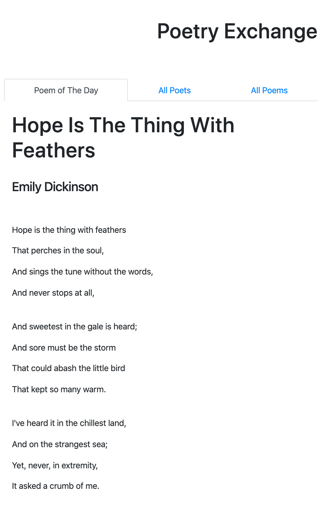

### Your Daily Dose of Poetry
built with React, PostgreSQL, data from [poetryDB](https://github.com/thundercomb/poetrydb/blob/master/README.md)

Some friends and I have been exchanging poems everyday since the lockdown, which brings lots of comfort and deepens our connections. So I decided to make a website on poetry so I can build something I love using the tools I enjoy! 

#### User Stories: 
- [ ] receive one poem a day (randomly generated but daily poems do not repeat)
- [ ] can search database by author (full name or partial name)
- [ ] can search database by title (full title or partial title)
- [ ] can search database by lines (full line or partial line)
- [ ] can see the full list of poems
- [ ] can see the full list of authors and all poems by each author

#### Dev Process: 

  - [x] set up project using React and Bootstrap
  - [x] get all poems from poetryDB; convert json to csv; ready to be imported to database using postgreSQL
  - [x] set up react router
  - [x] set up page layout, with 'Hope' :)
  - [x] set up express app and psql database
  - [x] set up proxy so the react app can make queries to the database
  - [x] test proxy with mock api call
  - [x] set up database using psql shell, created poems table (instead of importing from csv file), copy data from csv file using psgl shell
  - [x] add express routes
  - [x] set up queries from frontend to database
  - [x] implement caseinsensitive search
  

