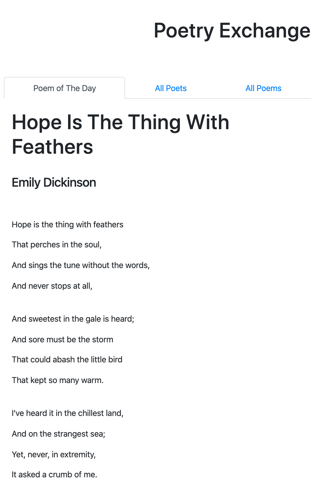

### Your Daily Dose of Poetry
built with React, PostgreSQL, data from [poetryDB](https://github.com/thundercomb/poetrydb/blob/master/README.md)

#### User Stories: 
- [ ] receive one poem a day (randomly generated but daily poems do not repeat)
- [ ] can search database by author (full name or partial name)
- [ ] can search database by title (full title or partial title)
- [ ] can search database by lines (full line or partial line)
- [ ] can see the full list of poems
- [ ] can see the full list of authors and all poems by each author

#### Dev Process: 
* set up 
  - project using React and Bootstrap
  - get all poems from poetryDB; convert json to csv; ready to be imported to database using postgreSQL
  - set up page layout, with 'Hope' :)

